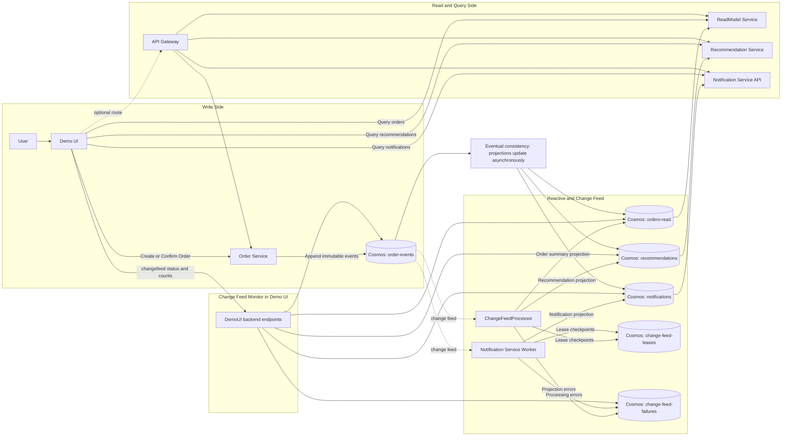

# Commerce Platform Architecture Diagram

This file contains the Mermaid chart for the full application flow.

## Mermaid (Render In Markdown Preview)



## Raw Mermaid (Copy/Paste To Mermaid Live)

```text
flowchart LR
  U[User]
  UI[Demo UI]

  subgraph WritePath[Write Side]
    OS[Order Service]
    OE[(Cosmos: order-events)]
    U --> UI
    UI -->|Create or Confirm Order| OS
    OS -->|Append immutable events| OE
  end

  subgraph ReactivePath[Reactive and Change Feed]
    CFP[ChangeFeedProcessor]
    NS[Notification Service Worker]
    OR[(Cosmos: orders-read)]
    RE[(Cosmos: recommendations)]
    NO[(Cosmos: notifications)]
    LE[(Cosmos: change-feed-leases)]
    FA[(Cosmos: change-feed-failures)]

    OE -. change feed .-> CFP
    OE -. change feed .-> NS

    CFP -->|Order summary projection| OR
    CFP -->|Recommendation projection| RE
    CFP -->|Lease checkpoints| LE
    CFP -->|Projection errors| FA

    NS -->|Notification projection| NO
    NS -->|Lease checkpoints| LE
    NS -->|Processing errors| FA
  end

  subgraph QueryPath[Read and Query Side]
    RMS[ReadModel Service]
    RS[Recommendation Service]
    NQS[Notification Service API]
    AGW[API Gateway]

    OR --> RMS
    RE --> RS
    NO --> NQS

    UI -->|Query orders| RMS
    UI -->|Query recommendations| RS
    UI -->|Query notifications| NQS

    UI -. optional route .-> AGW
    AGW --> RMS
    AGW --> RS
    AGW --> NQS
    AGW --> OS
  end

  subgraph MonitorPath[Change Feed Monitor in Demo UI]
    DUIAPI[DemoUI backend endpoints]
    UI -->|changefeed status and counts| DUIAPI
    DUIAPI --> OR
    DUIAPI --> RE
    DUIAPI --> NO
    DUIAPI --> FA
    DUIAPI --> OE
  end

  EC[Eventual consistency: projections update asynchronously]
  OE --> EC
  EC --> OR
  EC --> RE
  EC --> NO
```
